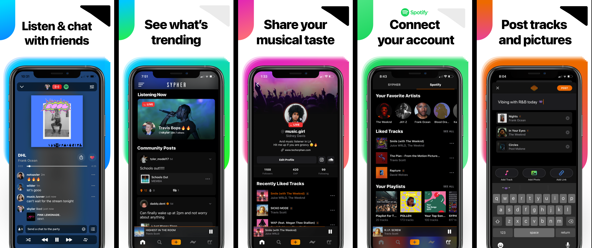

## Hi there 👋
I am an aspiring software engineer with an entrepreneurial drive. I am seeking to join a mission-driven team that is undertaking challenging, change-making problems. I am incredibly passionate about designing and developing iOS/Web applications. This passion is demonstrated through several startup endeavors and personal projects.

 

# My Projects

## SYPHER Music - A Social Music Network
[App Store Link](https://apps.apple.com/us/app/sypher-music/id1374755518)

## Loan Link - Fintech App
[Landing Page](https://loanlink.io)

## COVID Dashboard

<!-- ## Student Loan Calculator - Amortization Calculator

 -->
 
* [Student Loan Calculator](https://apps.apple.com/us/app/student-loan-calculator/id1469171129)
* [TikPik](https://apps.apple.com/us/app/tikpik-new-profile-pictures/id1514358321)

